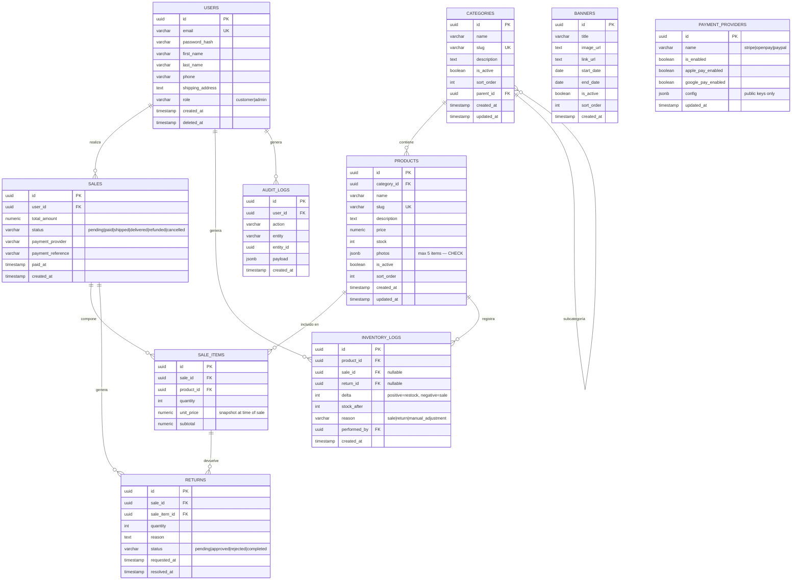

[APPROVED]
# SPEC.md — EcommFast
> **Estado:** PENDIENTE DE APROBACIÓN — Añadir `[APPROVED]` al inicio de este archivo para habilitar el desarrollo.

---

## 1. Modelo de Datos E-R

### 1.1 Diagrama Entidad-Relación (Mermaid)



---

## 2. Constraints SQL Críticos

```sql
-- Stock nunca negativo
ALTER TABLE products ADD CONSTRAINT chk_stock_non_negative CHECK (stock >= 0);

-- Máximo 5 fotos por producto
ALTER TABLE products ADD CONSTRAINT chk_photos_max_5
  CHECK (jsonb_array_length(photos) <= 5);

-- Precio positivo
ALTER TABLE products ADD CONSTRAINT chk_price_positive CHECK (price > 0);

-- Cantidad de venta positiva
ALTER TABLE sale_items ADD CONSTRAINT chk_quantity_positive CHECK (quantity > 0);

-- Delta de inventario no puede ser cero
ALTER TABLE inventory_logs ADD CONSTRAINT chk_delta_nonzero CHECK (delta != 0);
```

---

## 3. Requerimientos Funcionales

### RF-01 — Catálogo Público
- **GET /api/products** — Lista productos activos cuya categoría también sea `is_active = true`, ordenados por `sort_order ASC`.
- Filtros: `?category_slug=`, `?search=`, `?page=`, `?limit=`
- **GET /api/products/:slug** — Detalle de producto con fotos y stock disponible (booleano, no el número exacto).
- **GET /api/categories** — Lista categorías activas con sus hijos (árbol).
- **GET /api/banners** — Banners activos donde `start_date <= NOW() <= end_date`.

### RF-02 — Autenticación
- **POST /api/auth/register** — Registro de usuario (customer).
- **POST /api/auth/login** — Login, retorna access JWT (15min) + refresh en httpOnly cookie.
- **POST /api/auth/refresh** — Renueva access token.
- **POST /api/auth/logout** — Invalida refresh token.

### RF-03 — Checkout e Inventario
- **POST /api/checkout** — Crea orden y procesa pago.
  - Validar que todos los productos tengan stock >= cantidad solicitada (dentro de transacción DB serializable).
  - Si pago confirma: descontar stock, crear `sale`, `sale_items`, `inventory_logs`.
  - Si pago falla: rollback total — sin modificación de stock.
- **Regla crítica:** El descuento de stock y la confirmación de pago son ATÓMICOS. No hay estado intermedio.

### RF-04 — Devoluciones
- **POST /api/returns** — Solicita devolución.
  - Validar: `fecha_actual <= sale.paid_at + 30 días` (calculado en backend con fecha de DB).
  - Si válido: crea registro en `returns` con status `pending`.
- **PATCH /api/admin/returns/:id** — Admin aprueba/rechaza.
  - Si `approved`: incrementa stock, crea `inventory_log`, procesa reembolso en gateway.

### RF-05 — Panel de Admin
- **CRUD /api/admin/products** — Crear, editar, desactivar productos con fotos (max 5).
- **CRUD /api/admin/categories** — CRUD con `is_active` y `sort_order`. Al desactivar: cascada automática oculta productos en queries (no actualiza registros).
- **CRUD /api/admin/banners** — CRUD con `start_date`, `end_date`.
- **GET/PATCH /api/admin/payment-providers** — Ver y toggle `is_enabled`, `apple_pay_enabled`, `google_pay_enabled` por provider.
- **GET /api/admin/inventory-logs** — Estadísticas de movimientos de inventario.

### RF-06 — Visibilidad en Cascada
- Query de productos públicos incluye siempre:
  ```sql
  JOIN categories c ON products.category_id = c.id
  WHERE products.is_active = true AND c.is_active = true
  ```
- El frontend NUNCA recibe productos de categorías inactivas.

---

## 4. Requerimientos No Funcionales

| ID | Requerimiento | Métrica |
|----|--------------|---------|
| RNF-01 | Tiempo de respuesta API catálogo | < 200ms p95 con índices |
| RNF-02 | Checkout concurrente | Soportar 50 checkouts simultáneos sin race condition en stock |
| RNF-03 | Disponibilidad | 99.5% uptime (monolito, sin SLA enterprise en MVP) |
| RNF-04 | Seguridad de pagos | PCI-DSS delegado 100% a gateways — no almacenar datos de tarjeta |
| RNF-05 | Fotos | Máximo 5MB por imagen, formatos: jpg, png, webp |
| RNF-06 | Accesibilidad frontend | WCAG 2.1 AA mínimo en componentes core |

---

## 5. Contratos de API — Ejemplos de Payload

### POST /api/checkout
```json
// Request
{
  "items": [
    { "product_id": "uuid", "quantity": 2 }
  ],
  "payment_provider": "stripe",
  "payment_method_id": "pm_xxx"
}

// Response 201
{
  "sale_id": "uuid",
  "status": "paid",
  "total_amount": 150.00,
  "paid_at": "2026-03-26T18:00:00Z"
}

// Response 422 — Sin stock
{
  "error": "INSUFFICIENT_STOCK",
  "message": "El producto 'Camiseta Azul' no tiene stock suficiente.",
  "product_id": "uuid"
}
```

### POST /api/returns
```json
// Request
{
  "sale_id": "uuid",
  "sale_item_id": "uuid",
  "quantity": 1,
  "reason": "Talla incorrecta"
}

// Response 422 — Fuera de ventana
{
  "error": "RETURN_WINDOW_EXPIRED",
  "message": "El plazo de devolución de 30 días ha expirado.",
  "sale_date": "2026-02-01T10:00:00Z",
  "deadline": "2026-03-03T10:00:00Z"
}
```

---

## 6. Diseño Frontend — "Alegre pero Sobrio"

### 6.1 Paleta de Colores (Tailwind tokens)
```js
// tailwind.config.ts
colors: {
  primary:   '#4F46E5', // Indigo — acción principal
  secondary: '#F59E0B', // Amber — ofertas / badges
  accent:    '#10B981', // Emerald — éxito / stock disponible
  danger:    '#EF4444', // Red — errores / agotado
  surface:   '#F9FAFB', // Gray-50 — fondo página
  card:      '#FFFFFF', // Blanco — tarjetas
  text:      '#111827', // Gray-900 — texto principal
  muted:     '#6B7280', // Gray-500 — texto secundario
}
```

### 6.2 Componentes Core a Desarrollar
| Componente | Descripción |
|-----------|-------------|
| `<ProductCarousel>` | Embla carousel, auto-play 4s, filtro por categoría, dots de navegación |
| `<ProductZoom>` | Lupa en hover sobre imagen principal del detalle |
| `<CategoryTree>` | Menú desplegable con jerarquía de categorías activas |
| `<BannerSlider>` | Rotación automática de banners temporales |
| `<PaymentAdmin>` | Tabla de providers con toggles is_enabled / apple_pay / google_pay |
| `<AdminProductForm>` | Upload multi-imagen (max 5), preview, sort_order |
| `<ReturnFlow>` | Wizard de solicitud de devolución con validación de fecha |

---

## 7. Criterios de Aceptación (Definition of Done)

- [ ] Checkout con stock = 0 retorna error 422 y NO modifica la DB.
- [ ] Devolución fuera de 30 días retorna error 422 con fecha límite en respuesta.
- [ ] Desactivar categoría → productos no aparecen en `GET /api/products` ni en frontend.
- [ ] Banners solo visibles entre `start_date` y `end_date`.
- [ ] Toggle de Apple Pay en admin panel → el método desaparece/aparece en checkout.
- [ ] Upload de más de 5 fotos retorna error de validación.
- [ ] 100% de queries con parámetros — sin concatenación de strings SQL.
- [ ] JWT inválido en endpoints admin retorna 401.
- [ ] Tests de integración pasan para RF-01 a RF-06.

---

## 8. Casos Borde Documentados

| Caso | Comportamiento Esperado |
|------|------------------------|
| Dos usuarios compran el último item simultáneamente | Transacción serializable en DB — uno recibe éxito, otro recibe INSUFFICIENT_STOCK |
| Admin desactiva categoría padre con subcategorías activas | Todos los productos de toda la rama quedan ocultos (query recursiva CTE) |
| Banner con `start_date = end_date` | Visible solo ese día (inclusive en ambos extremos) |
| Devolución parcial (solo algunos items de una venta) | Solo se reintegra el stock de los items devueltos |
| Producto reactivado después de que su categoría fue desactivada | Sigue oculto hasta que la categoría vuelva a estar activa |
